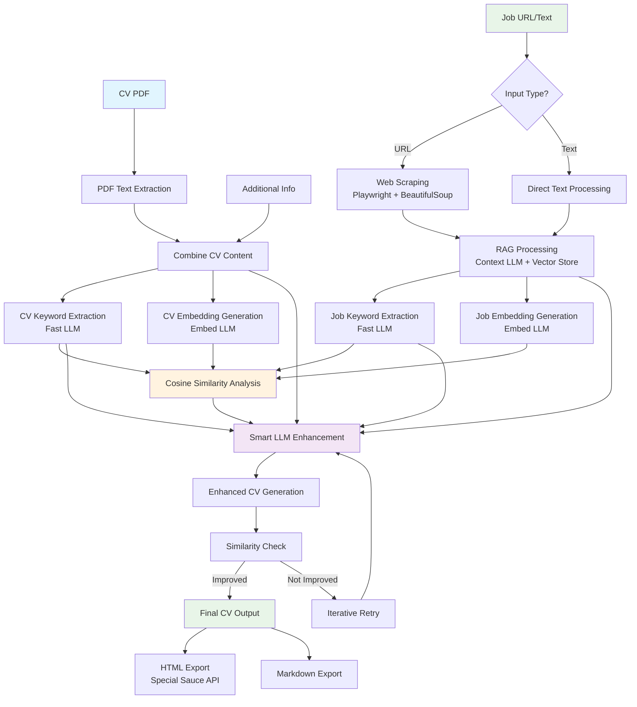

# Knitty: Resume Factory

<div align="center">
  
</div>

<div align="center">
  <strong>An intelligent CV tailoring system that optimizes resumes for specific job postings using advanced LLM technology and cosine similarity analysis.</strong>
</div>

<br>

## 🚀 Overview

Knitty is a proof-of-concept Jupyter notebook that demonstrates how AI can be used to automatically enhance CVs for better job application success. The system analyzes your existing CV alongside a target job posting, then generates an optimized version that better aligns with the job requirements while maintaining authenticity and professional quality.

**⚠️ Important Note: This notebook serves as a starting point for a much larger project.** The current implementation is a research prototype that showcases the core concepts and workflow. We envision expanding this into a full-scale application with a web interface, database integration, and enterprise-grade features.

## ✨ Key Features

- **🔄 Multi-LLM Architecture**: Leverages four specialized AI models for different tasks
- **📄 PDF Processing**: Extracts and processes CV content from PDF files
- **🌐 Web Scraping**: Automatically fetches job postings from LinkedIn and other platforms
- **🧠 RAG-Powered Analysis**: Uses Retrieval-Augmented Generation for intelligent job content extraction
- **📊 Similarity Scoring**: Measures CV-job alignment using cosine similarity
- **🎯 Smart Enhancement**: Generates tailored CVs while maintaining professional quality
- **🔁 Iterative Improvement**: Automatically retries generation if similarity doesn't improve
- **📱 HTML Export**: Converts final CVs to professional HTML format

## 🏗️ Architecture

The system operates through a sophisticated multi-stage pipeline:



### LLM Specialization

- **Fast LLM** (for example: GPT-OSS-120B): Quick keyword extraction from CV and job postings
- **Context LLM**: Large-context processing for web-scraped content and RAG operations
- **Embed LLM**: Generates high-quality embeddings for similarity analysis
- **Smart LLM** (Currently using: Gemini 2.5 Pro): Advanced CV enhancement and generation

## 🛠️ Technical Implementation

### Core Technologies

- **LangChain**: Document processing, embeddings, and LLM orchestration
- **Playwright**: Robust web scraping for job postings
- **BeautifulSoup**: HTML cleaning and text extraction
- **NumPy**: Mathematical operations for similarity calculations
- **PyPDF**: PDF text extraction and processing

### Advanced Features

- **RAG Pipeline**: Uses InMemoryVectorStore for intelligent content retrieval
- **Async Processing**: Non-blocking web scraping with proper Windows compatibility
- **Template System**: YAML-based CV templates for consistent formatting
- **Configuration Management**: File-based prompt and template management
- **Error Handling**: Comprehensive error recovery and retry mechanisms

## 🚀 Getting Started

### Prerequisites

```bash
pip install python-dotenv numpy
pip install langchain-community langchain-openai langchain-core
pip install beautifulsoup4 playwright requests
playwright install chromium
```

### Environment Setup

Create a `.env` file with your LLM API configurations:

```env
# Fast LLM for keyword extraction
FAST_LLM_API_KEY="your-api-key"
FAST_LLM_API_BASE="https://api.provider.com/v1"
FAST_LLM_MODEL_NAME="openai/gpt-oss-120b"

# Context LLM for RAG processing
CONTEXT_LLM_API_KEY="your-api-key"
CONTEXT_LLM_API_BASE="https://api.provider.com/v1"
CONTEXT_LLM_MODEL_NAME="your-context-model"

# Embedding LLM for similarity analysis
EMBED_LLM_API_KEY="your-api-key"
EMBED_LLM_API_BASE="https://api.provider.com/v1"
EMBED_LLM_MODEL_NAME="text-embedding-model"

# Smart LLM for CV generation
SMART_LLM_API_KEY="your-api-key"
SMART_LLM_API_BASE="https://api.provider.com/v1"
SMART_LLM_MODEL_NAME="gemini-2.5-pro"

# Optional: HTML conversion service
SPECIAL_SAUCE_API_URL="https://cv-service.com/generate"
SPECIAL_SAUCE_API_KEY="your-service-key"
```

### Usage

1. **Open the notebook**: Launch `notebook.ipynb` in Jupyter
2. **Configure inputs**: Set your CV path and job posting URL/text
3. **Run sequentially**: Execute cells in order for complete processing
4. **Review results**: Check similarity improvements and final CV output

## 📊 How It Works

### 1. Input Processing

- Extracts text from PDF CVs using PyPDFLoader
- Combines CV content with additional information
- Processes job postings via web scraping or direct text input

### 2. Keyword Analysis

- Uses Fast LLM to extract professional keywords from both sources
- Returns structured JSON arrays of relevant terms and phrases
- Focuses on technical skills, experience, and job requirements

### 3. Similarity Measurement

- Generates embeddings for keyword sets using specialized models
- Calculates cosine similarity to quantify CV-job alignment
- Establishes baseline metrics for improvement tracking

### 4. Intelligent Enhancement

- Uses Smart LLM to generate optimized CV based on analysis
- Maintains professional tone and template compliance
- Includes iterative improvement with similarity feedback

### 5. Quality Assurance

- Measures improvement in cosine similarity scores
- Automatically retries if enhancement doesn't improve alignment
- Exports final CV in both markdown and HTML formats

## 📈 Results

The system typically achieves:

- **Baseline Similarity**: 40-70% initial CV-job alignment
- **Improvement Range**: +5% to +15% similarity increase
- **Quality Metrics**: Professional presentation with strategic keyword integration
- **Processing Time**: ~30-60 seconds for complete enhancement

## 🔮 Future Vision

You'll have to wait for that 😉

## 🤝 Contributing

We welcome contributions to help evolve this prototype into a production-ready platform! Areas where we need help:

- **Backend Development**: FastAPI/Django web framework implementation
- **Frontend Development**: React/Vue.js user interface design
- **DevOps**: Docker containerization and cloud deployment
- **AI/ML**: Model fine-tuning and optimization
- **Testing**: Comprehensive test suite development
- **Documentation**: API documentation and user guides

## 📚 Documentation

- [Architecture Guide](docs/ARCHITECTURE.md) - Detailed system architecture
- [API Reference](docs/API_REFERENCE.md) - Function signatures and data models
- [Development Guide](docs/DEVELOPMENT_GUIDE.md) - Setup and development instructions
- [Scoring Process](docs/SCORING_PROCESS.md) - Similarity calculation methodology

## ⚖️ License

This project is currently in research and development phase. License terms will be established as the project evolves toward production release.

## 🙏 Acknowledgments

- LangChain team for excellent LLM orchestration tools
- OpenAI for embedding and language model APIs
- Playwright team for robust web automation capabilities
- The open-source community for inspiration and foundational technologies

---

<div align="center">
  <strong>Ready to revolutionize your job applications? Start with the notebook and join us in building the future of CV optimization!</strong>
</div>
