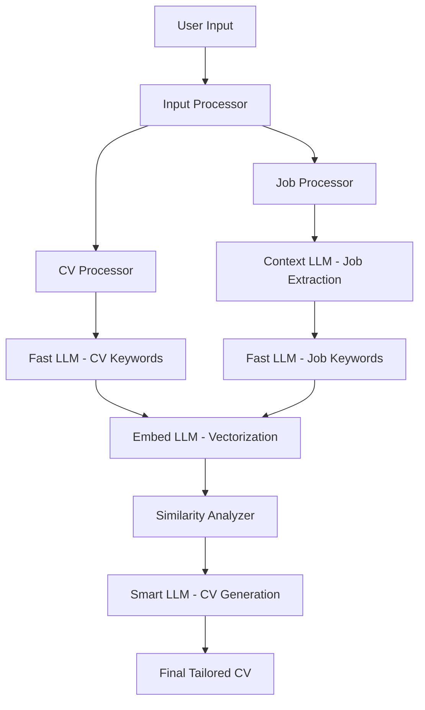

# System Architecture

This document provides a comprehensive overview of Knitty: Resume Factory's architecture, including system components, data flow, and integration patterns.

## 🏗️ High-Level Architecture

Knitty follows a modular, pipeline-based architecture designed for scalability and maintainability. The system is organized into four main processing stages, each utilizing specialized LLMs for optimal performance.



## 🔧 System Components

### 1. Input Processor (`src/processors/`)

**Responsibility**: Handle initial data ingestion and validation.

**Components**:
- `cv_processor.py`: Processes CV files (PDF/text) and additional information
- `job_processor.py`: Handles job posting URLs and raw text input
- `keyword_extractor.py`: Extracts professional keywords using Fast LLM

**Key Functions**:
```python
def process_cv_file(file_path: str, additional_info: str = "") -> CVData
def process_job_posting(url: str = None, text: str = None) -> JobData
def extract_keywords(text: str, llm_config: LLMConfig) -> List[str]
```

### 2. Similarity Analyzer (`src/analyzers/`)

**Responsibility**: Calculate semantic similarity between CV and job requirements.

**Components**:
- `similarity_analyzer.py`: Implements cosine similarity calculation

**Key Functions**:
```python
def generate_embeddings(keywords: List[str], embed_llm: LLMConfig) -> np.ndarray
def calculate_cosine_similarity(cv_embedding: np.ndarray, job_embedding: np.ndarray) -> float
```

### 3. CV Generator (`src/generators/`)

**Responsibility**: Generate optimized CV using Smart LLM.

**Components**:
- `cv_generator.py`: Orchestrates final CV generation

**Key Functions**:
```python
def generate_tailored_cv(
    cv_data: CVData,
    job_data: JobData,
    similarity_score: float,
    template: str
) -> str
```

### 4. Utilities (`src/utils/`)

**Responsibility**: Support functions and configurations.

**Components**:
- `llm_config.py`: LLM configuration management
- `pdf_extractor.py`: PDF text extraction utilities
- `web_scraper.py`: Job posting web scraping functionality

## 🔄 Data Flow

### Stage 1: Input Processing
1. **CV Processing**:
   - Detect file type (PDF/text)
   - Extract raw text using PyMuPDF or direct reading
   - Append additional information if provided
   - Validate and clean extracted text

2. **Job Posting Processing**:
   - If URL provided: Use RAGJobExtractor with Context LLM
   - If text provided: Use directly
   - Extract structured job information

### Stage 2: Keyword Extraction
1. **CV Keywords**:
   - Send processed CV text to Fast LLM
   - Extract professional keywords using specialized prompt
   - Return JSON array of keywords

2. **Job Keywords**:
   - Send job description to Fast LLM
   - Extract relevant job-specific keywords
   - Return JSON array of keywords

### Stage 3: Similarity Analysis
1. **Embedding Generation**:
   - Convert CV keywords to vector embeddings using Embed LLM
   - Convert job keywords to vector embeddings using Embed LLM

2. **Similarity Calculation**:
   - Compute cosine similarity between embeddings
   - Return numerical similarity score (0.0 to 1.0)

### Stage 4: CV Generation
1. **Context Assembly**:
   - Gather all processed data:
     - Original CV text
     - Job description
     - Extracted keywords (both sources)
     - Similarity score
     - CV template

2. **Smart LLM Processing**:
   - Send comprehensive prompt to Smart LLM
   - Generate optimized CV content
   - Apply template formatting
   - Return final markdown CV

## 🤖 LLM Integration Strategy

### LLM Configuration Management
```python
@dataclass
class LLMConfig:
    api_key: str
    api_base: str
    model_name: str
    max_tokens: Optional[int] = None
    temperature: Optional[float] = None
```

### LLM Role Specialization

1. **Fast LLM** (Keyword Extraction):
   - **Purpose**: Quick, cost-effective keyword extraction
   - **Requirements**: Fast response, good accuracy for keyword tasks
   - **Typical Models**: GPT-3.5-turbo, Claude Haiku, Gemini Flash

2. **Context LLM** (Large Document Processing):
   - **Purpose**: Process entire web pages and large documents
   - **Requirements**: Large context window (32k+ tokens)
   - **Typical Models**: GPT-4-turbo, Claude Sonnet, Gemini Pro

3. **Embed LLM** (Vector Embeddings):
   - **Purpose**: Generate semantic embeddings for similarity analysis
   - **Requirements**: High-quality embeddings, consistent vector dimensions
   - **Typical Models**: text-embedding-ada-002, text-embedding-3-large

4. **Smart LLM** (CV Generation):
   - **Purpose**: High-quality, context-aware content generation
   - **Requirements**: Advanced reasoning, creative writing, template following
   - **Typical Models**: GPT-4, Claude Opus, Gemini Ultra

## 🔐 Error Handling and Resilience

### Retry Mechanisms
- Exponential backoff for API failures
- Fallback to alternative LLM providers
- Graceful degradation for non-critical features

### Input Validation
- File type and size validation
- URL accessibility checks
- API key and configuration validation

### Output Quality Assurance
- Keyword extraction validation
- Similarity score bounds checking
- Template compliance verification

## 🚀 Performance Considerations

### Caching Strategy
- Cache extracted job postings by URL
- Cache keyword extractions for duplicate content
- Cache embeddings for repeated keyword sets

### Concurrent Processing
- Parallel keyword extraction for CV and job posting
- Asynchronous API calls where possible
- Background processing for non-blocking operations

### Resource Management
- Connection pooling for HTTP requests
- Memory-efficient PDF processing
- Cleanup of temporary files and resources